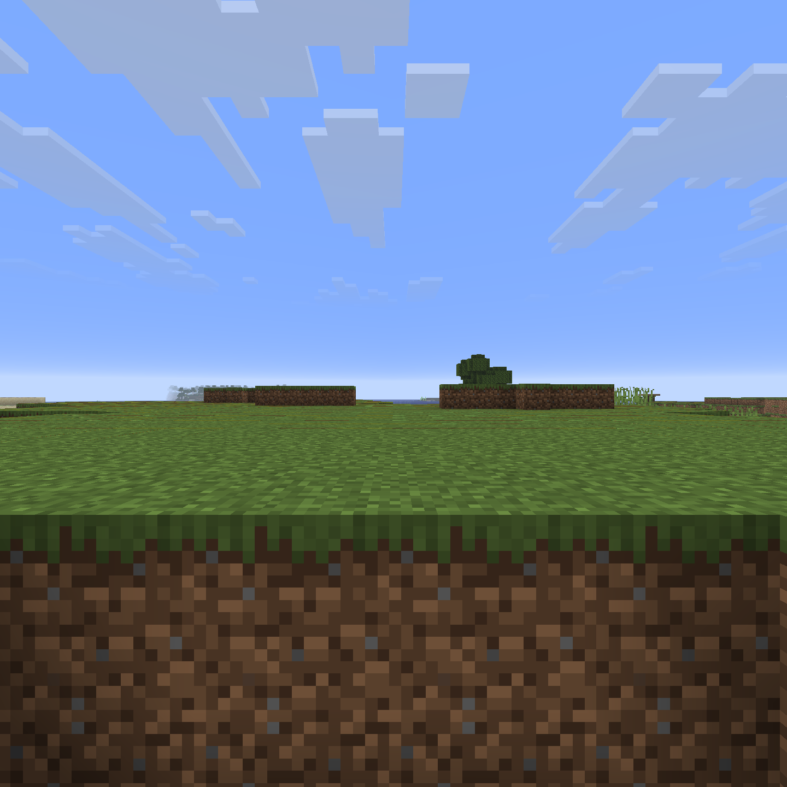
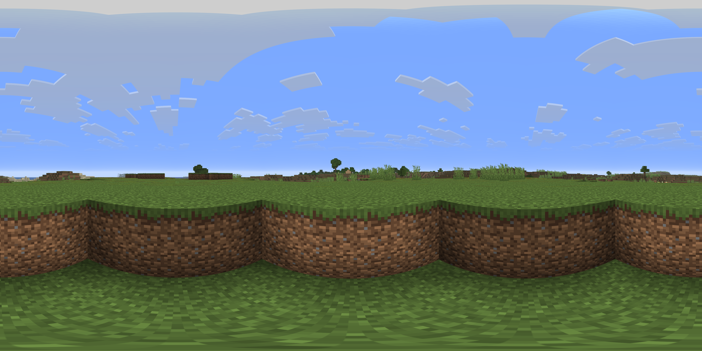

# 🧭 Cubemap → Equirectangular Converter

[](https://www.python.org/)
[](https://opencv.org/)
[](https://github.com/saimj7/py360convert)
[](https://opensource.org/licenses/MIT)
[](#)

---

A lightweight Python utility that automatically installs its dependencies and converts **6 cubemap face images**
(`posx`, `negx`, `posy`, `negy`, `posz`, `negz`) into a single **equirectangular panorama**.

---

## ✨ Features

* 🧰 **Auto-Installs Dependencies** – Missing libraries install automatically, no setup needed.
* 🖼 **Smart Center Crop** – Crops input images to perfect squares for clean alignment.
* 🔧 **Adjustable Resolution** – Choose your cubemap face size (`--face 512`, `--face 2048`, etc.).
* 🌐 **Full 360° Output** – Produces a seamless equirectangular panorama (`panorama.png`).

---

## 🚀 Quick Start

### 1. Prepare Your Images

Place your six cube faces in the same directory as the script:

```
posx.png, negx.png, posy.png, negy.png, posz.png, negz.png
```

### 2. Run the Script

```bash
python script.py --face 1024
```

| Argument | Description                                     | Default |
| -------- | ----------------------------------------------- | ------- |
| `--face` | Resolution per cube face (e.g. 512, 1024, 2048) | 1024    |

After execution, `panorama.png` will be generated in the current directory.

---

## 🧩 Requirements

The script installs dependencies automatically, but you can also install them manually:

```bash
pip install opencv-python numpy py360convert argparse
```

---

## 📂 How It Works

1. Loads all six cube faces with OpenCV.
2. Crops each face to a centered square.
3. Resizes them to the specified resolution.
4. Uses **py360convert** to merge into an equirectangular panorama.
5. Saves the result as `panorama.png`.

---

## 🧠 Example Output

| Example Input Face (6 faces needed)                                                                                                                   | Example Output                                                                                                                                                          |
| ----------------------------------------------------------------------------------------------------------------------------- | --------------------------------------------------------------------------------------------------------------------------------------------------------------- |
|  |  |

---

## 🧩 Notes

* Ensure cube faces are **aligned correctly** (`+X` = Right, `−X` = Left, etc.).
* Works best with equal aspect-ratio images.
* The output is saved as **PNG** by default.

---

## ⚡ License

**MIT License © 2025 Moksh Verma**
You’re free to modify, distribute, or integrate this into your 3D, VR, or panoramic workflows.
